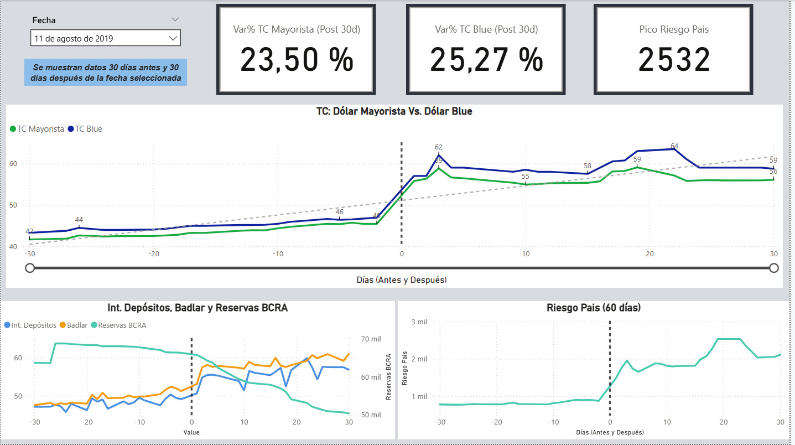
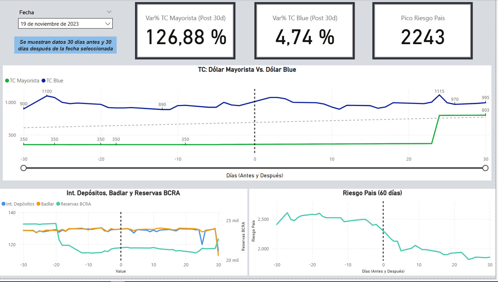

<!-- Language Selector -->

  <a href="#versión-en-español">Español</a> • <a href="#english-version">English</a>  

---
<!-- SPANISH VERSION -->
<h2 id="versión-en-español"> </h2>

# Análisis de la variación del Tipo de Cambio por las elecciones en Argentina (2015-2025)

## 1. Resumen del Proyecto

Este proyecto analiza las variaciones del tipo de cambio ocurridas por las elecciones. Se utilizan datos públicos del **BCRA** y consultoras privadas para el período 2015-2025, el objetivo es ver las modificaciones de cotización de las divisas en períodos pre y post electorales.

## 2. Tecnologías y Herramientas

*   **ETL y Modelado de Datos:** Excel
*   **Visualización y Análisis:** Power BI (DAX, Power Query)
*   **Control de Versiones:** Git / GitHub

## 3. Flujo de Trabajo y Estructura del Repositorio

El proyecto está estructurado para seguir un flujo de trabajo lógico de análisis de datos.

### 📂 `data/`
Esta carpeta contiene los archivos utilizados para compilar la información:
- **`fecha elecciones.xlsx`:** Contiene las fechas de las elecciones, tanto Paso, Generales y Ballotage.
- **`Indicadores economicos.xlsx`:** Contiene los valores diarios de los Tipos de Cambio Minoristas, Mayoristas, Blue, además del Badlar, Tasa de Interés por depósitos en entidades financieras, nivel de Reservas y Riesgo País .

### 📂 `powerbi/`
Contiene el archivo final de Power BI (`Analisis_TC.pbix`) con el modelo de datos, las medidas DAX y el dashboard interactivo.

### 📂 `images/`
Incluye capturas de pantalla de los dashboard finales para una vista previa rápida.

## 4. Hallazgos Clave

Los períodos electorales en Argentina son catalizadores de una significativa **incertidumbre y volatilidad financiera**. 
Los datos muestran de manera consistente que los 30 días previos y, especialmente, los 30 días posteriores a una elección, son momentos de alta tensión económica: **Los agentes económicos** reaccionan a las expectativas sobre los resultados generando presiones sobre las variables clave.

* **Tipo de Cambio (Dólar Mayorista y Dólar Blue):** 
                        
    * *Presión devaluatoria post-elección:* Una conclusión contundente es que las elecciones a menudo dan paso a una **corrección del tipo de cambio oficial**. En varios de los eventos más críticos (11 de agosto de 2019, 13 de agosto de 2023 y 19 de noviembre de 2023), se produjeron **saltos devaluatorios** muy importantes en los 30 días siguientes a la votación. El caso más extremo es el posterior a noviembre de 2023, con una variación del 126,88%. Esto sugiere un patrón de **"represión"** del tipo de cambio antes de las elecciones, seguido de un **ajuste** brusco.

    * *El Dólar Blue como termómetro de expectativas:* Antes de las elecciones, el **Dólar Blue** tiende a subir a medida que los ahorristas e inversores buscan **cobertura** ante la incertidumbre, después de la elección depende del resultado. Tras las **PASO** de 2019, se disparó junto con el oficial, señalando pánico. Sin embargo, tras las elecciones de 2015 y el balotaje de 2023, el **Blue** tendió a bajar, **reduciendo la brecha cambiaria**. Esto indica que el mercado percibió esos resultados como más favorables y propenso a una normalización económica, anticipando el fin de las **restricciones cambiarias**.
                      
 * **Riesgo País:** en las semanas previas a las elecciones se ve un aumento de esta variable provocado por la incertidumbre y la **aversión al riesgo**. El pico se alcanza luego de conocer los resultados y funciona como un veredicto del mercado acerca de quien ganó. Los resultados considerados "pro mercado" generan una tendencia a la baja de esta variable.

* **Reservas del BCRA, Depósitos y Tasa Badlar:**
    * *Caída de Reservas:* Las **reservas internacionales del Banco Central (BCRA)** tienden a caer durante los períodos electorales. Esto se debe a que el BCRA interviene en el mercado para controlar el tipo de cambio oficial y a una mayor demanda de dólares para importaciones y pago de deudas, en un contexto de menor oferta por la incertidumbre.

    * *Tasa Badlar:* La tasa de interés para **depósitos mayoristas (Badlar)** también refleja los intentos del BCRA por incentivar el ahorro en pesos y evitar una mayor **corrida hacia el dólar**.

En resumen, se puede observar un comportamiento cíclico previo y posterior a las elecciones en Argentina: 
Previo a los comicios, el gobierno de turno intenta mantener la **estabilidad cambiaria**, lo que genera un **atraso del dólar oficial** y una **pérdida de reservas**. El mercado, anticipando un ajuste inevitable, se **dolariza**, presionando el **Dólar Blue** y el **Riesgo País**.
Posterior a las elecciones,  independientemente de quién gane, a menudo es necesario un **sinceramiento** de las variables económicas, principalmente una **devaluación del peso**. La dirección y la intensidad de la reacción del mercado (**Riesgo País** y **Dólar Blue**) dependen críticamente de la credibilidad y la confianza que genere el resultado electoral.

## 5. Dashboard Final

El dashboard interactivo permite explorar estos hallazgos, filtrando por fecha de elección y viendo el comportamiento de las diferentes variables analizadas en los días anteriores y posteriores. A modo de ejemplo:

---
 
<!-- ENGLISH VERSION -->
<h2 id="english-version"> </h2>

# Analysis of Exchange Rate Variation due to Elections in Argentina (2015-2025)

---

## 1. Project Summary

This project analyzes the exchange rate variations caused by elections. Public data from the **BCRA** (Central Bank of the Argentine Republic) and private consulting firms for the 2015-2025 period are used. The objective is to observe the modifications in the **quotation of currencies** in pre- and post-electoral periods.

---

## 2. Technologies and Tools

* **ETL and Data Modeling:** Excel
* **Visualization and Analysis:** Power BI (DAX, Power Query)
* **Version Control:** Git / GitHub

---

## 3. Workflow and Repository Structure

The project is structured to follow a logical data analysis workflow.

### 📂 `data/`
This folder contains the files used to compile the information:
- **`fecha elecciones.xlsx`:** Contains the dates of the elections, including **Paso** (Primary, Open, Simultaneous, and Mandatory Elections), **Generales** (General Elections), and **Ballotage** (Runoff).
- **`Indicadores economicos.xlsx`:** Contains the daily values of the **Retail Exchange Rates** (**Tipo de Cambio Minorista**), **Wholesale Exchange Rates** (**Tipo de Cambio Mayorista**), **Blue Dollar** (**Dólar Blue**), as well as the **Badlar Rate**, Interest Rate for deposits in financial institutions, **Reserve** level, and **Country Risk** (**Riesgo País**).

### 📂 `powerbi/`
Contains the final Power BI file (`Analisis_TC.pbix`) with the data model, DAX measures, and the interactive dashboard.

### 📂 `images/`
Includes screenshots of the final dashboards for a quick preview.

---

## 4. Key Findings

Electoral periods in Argentina are catalysts for significant **financial uncertainty and volatility**. The data consistently shows that the 30 days prior to, and especially the 30 days after, an election are moments of high economic tension: **Economic agents** react to expectations about the results, generating pressure on key variables.

* **Exchange Rate (Wholesale Dollar and Blue Dollar):**

    * *Post-election Devaluation Pressure:* A forceful conclusion is that elections often give way to a **correction of the official exchange rate**. In several of the most critical events (August 11, 2019, August 13, 2023, and November 19, 2023), very significant **devaluation jumps** occurred in the 30 days following the vote. The most extreme case is the one after November 2023, with a 126.88% variation. This suggests a pattern of exchange rate **"repression"** before the elections, followed by a sharp **adjustment**.

    * *The Blue Dollar as an Expectations Thermometer:* Before elections, the **Blue Dollar** tends to rise as savers and investors seek **hedge** against uncertainty; after the election, it depends on the result. Following the 2019 **PASO**, it shot up along with the official rate, signaling panic. However, after the 2015 elections and the 2023 runoff, the **Blue Dollar** tended to fall, reducing the **exchange rate gap** (**brecha cambiaria**). This indicates that the market perceived those results as more favorable and conducive to economic normalization, anticipating the end of **exchange restrictions** (**restricciones cambiarias**).

* **Country Risk (**Riesgo País**):** In the weeks leading up to the elections, an increase in this variable is observed, driven by uncertainty and **risk aversion**. The peak is reached after the results are known and functions as a market verdict on the winner. Results considered "pro-market" generate a downward trend for this variable.

* **BCRA Reserves, Deposits, and Badlar Rate:**
    * *Reserve Drop:* The international **reserves of the Central Bank (BCRA)** tend to fall during electoral periods. This is because the BCRA intervenes in the market to control the official exchange rate and because of higher dollar demand for imports and debt payments, in a context of lower supply due to uncertainty.

    * *Badlar Rate:* The interest rate for **wholesale deposits (Badlar)** also reflects the BCRA's attempts to incentivize savings in pesos and prevent a further **flight to the dollar** (**corrida hacia el dólar**).

In summary, a cyclical behavior can be observed before and after elections in Argentina:
Prior to the elections, the current government attempts to maintain **exchange rate stability**, leading to a **lag in the official dollar** (**atraso del dólar oficial**) and a **loss of reserves**. The market, anticipating an inevitable adjustment, **dollarizes** (**se dolariza**), pressuring the **Blue Dollar** and **Country Risk**.
Subsequent to the elections, regardless of the winner, a **"sinceramiento" (a recognition/adjustment to reality)** of the economic variables is often necessary, primarily a **devaluation of the peso**. The direction and intensity of the market reaction (**Country Risk** and **Blue Dollar**) depend critically on the credibility and confidence generated by the electoral result.

---

## 5. Final Dashboard

The interactive dashboard allows for exploring these findings, filtering by election date and viewing the behavior of the different analyzed variables in the preceding and subsequent days. As an example:

